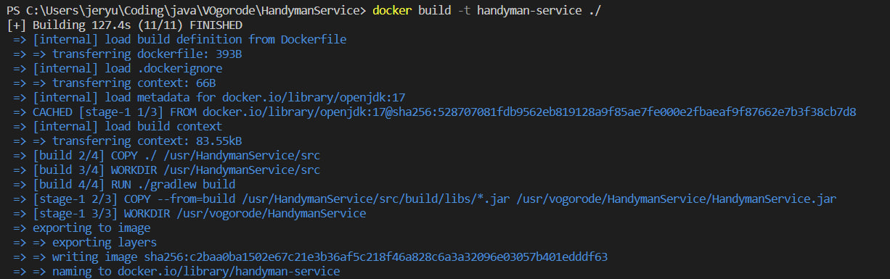
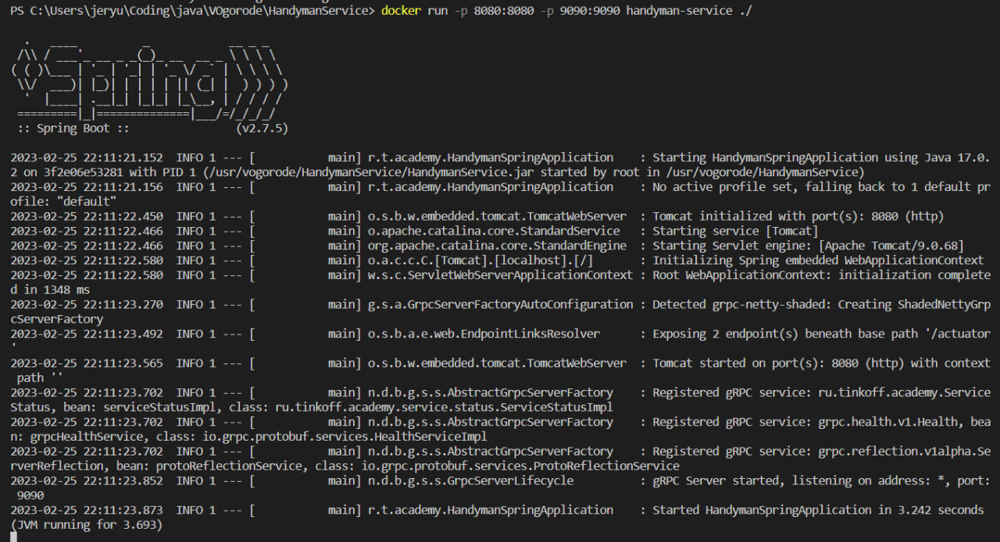
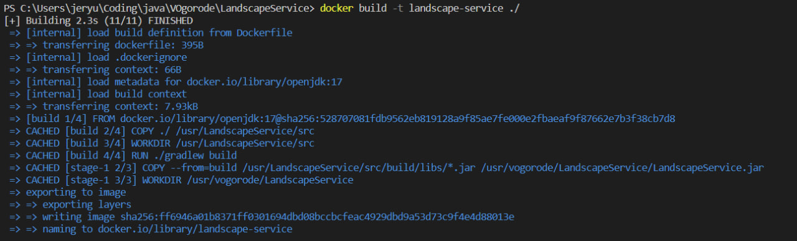
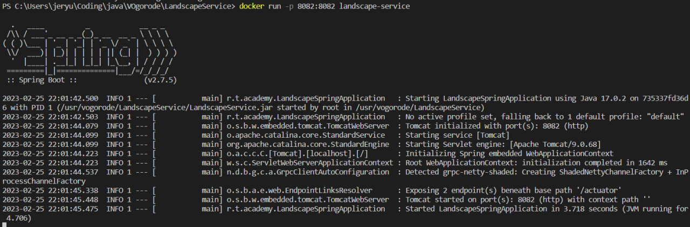
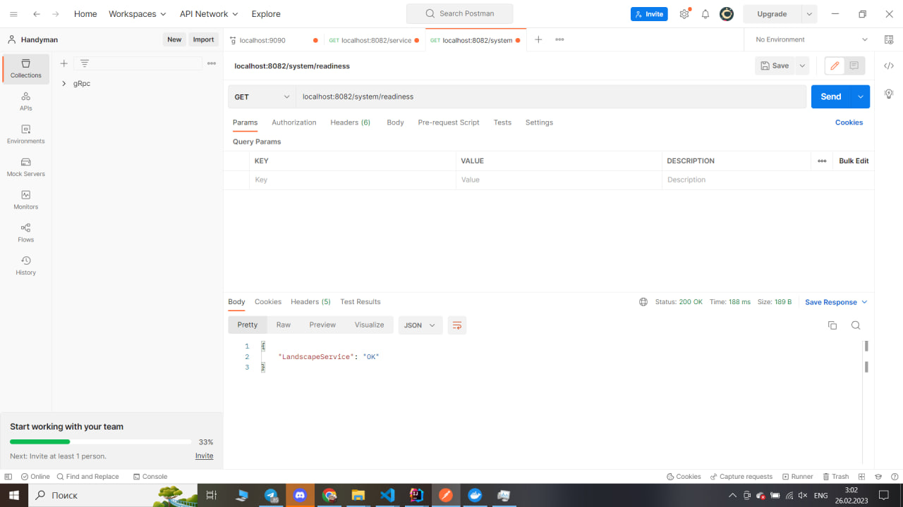
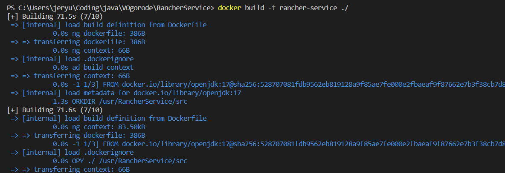
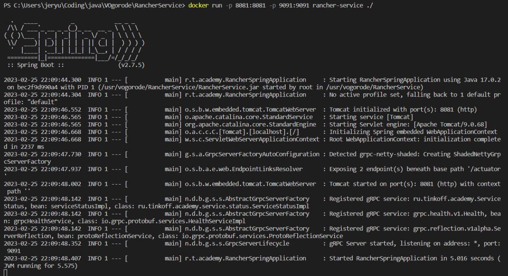

## Запуск сервисов с использованием Docker

Про используемые переменные окружения можно прочитать в [ENV_VAR.md](../docs/ENV_VAR/ENV_VAR.md)

Для всех сервисов необходимо определить подключение к базе данных с помощью описанных в файле выше переменных.

## HandymanService

[HandymanService Dockerfile](../HandymanService/Dockerfile)

1) Для запуска сервиса необходимо определить 2 переменные окружения **SERVER_PORT** и **GRPC_SERVER_PORT**.

2) Далее необходимо выполнить команду docker build -t <Название image'а> ./HandymanService

3) После выполнить docker run -p <Порт которые проброситься во вне>:<Порт определнный в **SERVER_PORT**> <Название
   image'а>

## LandscapeService

[LandscapeService Dockerfile](../LandscapeService/Dockerfile)

1) Для запуска необходимо определить 3 переменные окружения **SERVER_PORT**, **RANCHER_GRPC_SERVER_ADDRESS**, *
   *HANDYMAN_GRPC_SERVER_ADDRESS**.

2) Далее необходимо выполнить команду docker build -t <Название image'а> ./LandscapeService

3) После выполнить docker run -p <Порт которые проброситься во вне>:<Порт определнный в **SERVER_PORT**> <Название
   image'а>

## RancherService

[RancherService Dockerfile](../RancherService/Dockerfile)

1) Для запуска сервиса необходимо определить 2 переменные окружения **SERVER_PORT** и **GRPC_SERVER_PORT**.

2) Далее необходимо выполнить команду docker build -t <Название image'а> ./RancherService

3) После выполнить docker run -p <Порт которые проброситься во вне>:<Порт определнный в **SERVER_PORT**> <Название
   image'а>

## VOgorode

[Запуск с использованием docker-compose](./docker/README.md)

[Запуск сервисов без docker-compose](./infrastructure/README.md)
