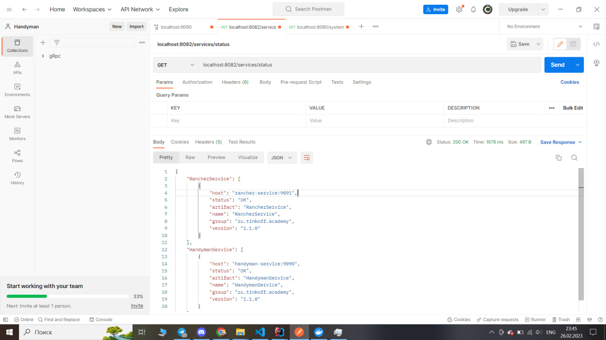

## Запуск с использованием docker-compose

1) Для запуска приложения обязательным является переопределение **RANCHER_GRPC_SERVER_ADDRESS**
   и **HANDYMAN_GRPC_SERVER_ADDRESS**. В сервисе LandscapeService docker-compose они определены как 
   'rancher-service:9091' и 'handyman-service:9090' соответсвенно.

2) Далее определяем адрес баз данных. Во всех сервисах Postgre, и Mongo в RancherService и HandymanService.

3) Также в RancherService и HandymanService определить адрес LandscapeService.

4) После командой docker-compose up запустить сервис.

