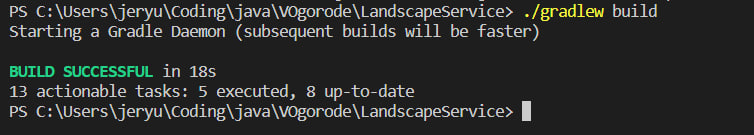
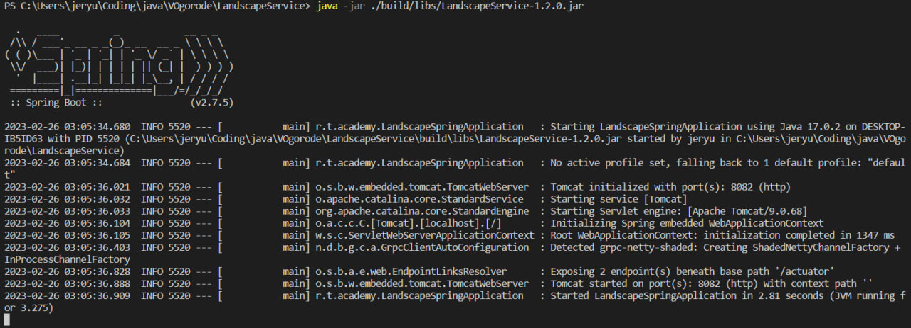

## Запуск сервисов без docker-compose

1) Запустить docker-compose в инфраструктурном режиме.

2) После собрать проект с использованием.

        ./gradlew build

   

3) Затем запустить jar-файл получившийся в результате сборки.

        java -jar ./<Название сервиса>/build/libs/<Название jar файла сервиса>.jar

   
   
