## HW 9

Для сбора статистики в сервисе Landscape были созданы соответствующие контроллеры и сервисы.
Они находятся в пакете statistics. Landscape общается с Rancher и Handyman по grpc.
С помощью написанных gradle тасок выполняются запросы на создание fields, fielders, bankAccounts, users.
Добавлены constraints на почту и телефон, тк с их помощью происходит определение аккаунта.
Добавил индексы для bank_accounts, accounts, fielders.

## Метрики по запросам в RancherService:

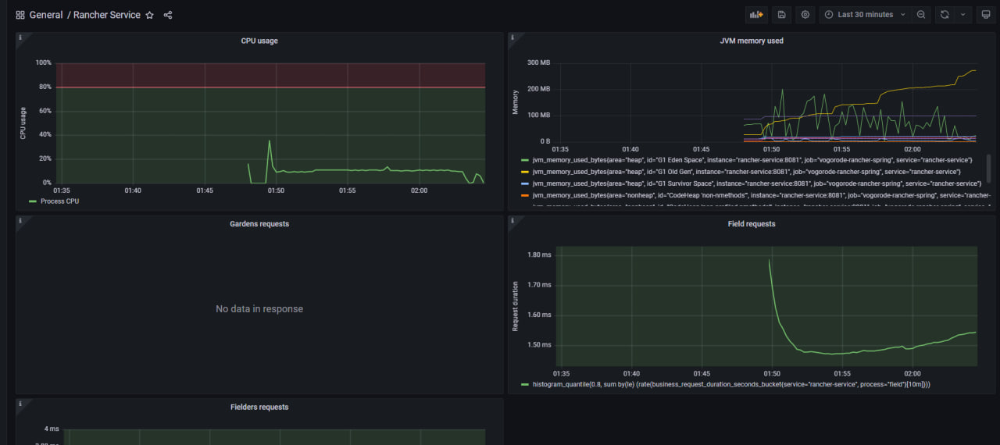
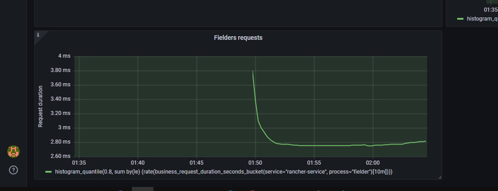

Изначально имеем высокую загруженность процессора из-за того, что приложение было не прогрето.
Соответственно и более высокую длительность ответа. Падение нагрузки на процессор в конце загрузки данных
обусловлен тем, как gradle очищает память в запущенных им процессах.

## Метрики по запросам в HandymanService:

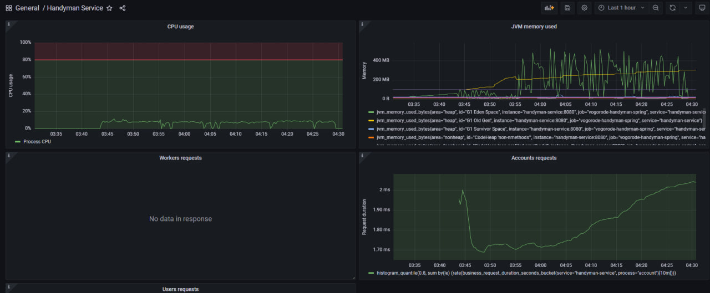
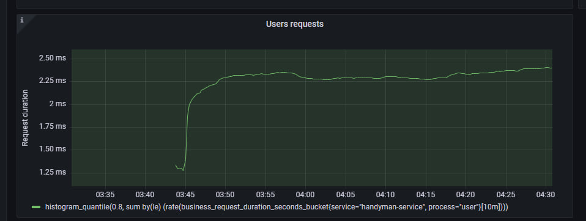

Здесь приложение было прогрето, тк до этого были неудачные попытки загрузить данные.
Падение нагрузки на процессор обусловлено теми же причинами, что и в Rancher'е.
Увеличение длительности обработки запросов по /users связано с увеличением числа банковских аккаунтов.
Тк при сохранении очередного пользователя необходимо найти аккаунты переданные в запросе и обновить их поле userId.
Увеличение длительности запросов по /accounts не знаю даже с чем и связать, как вариант с уменьшением оперативной памяти
на машине, тк к концу теста gradle таска хранила в памяти почти весь файл с sql запросами в accounts.

## Метрики статистики без индексов

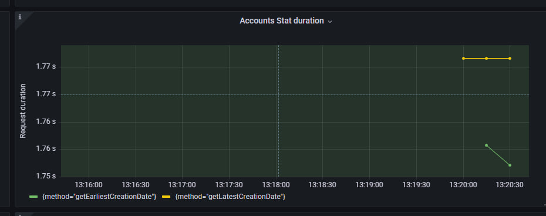
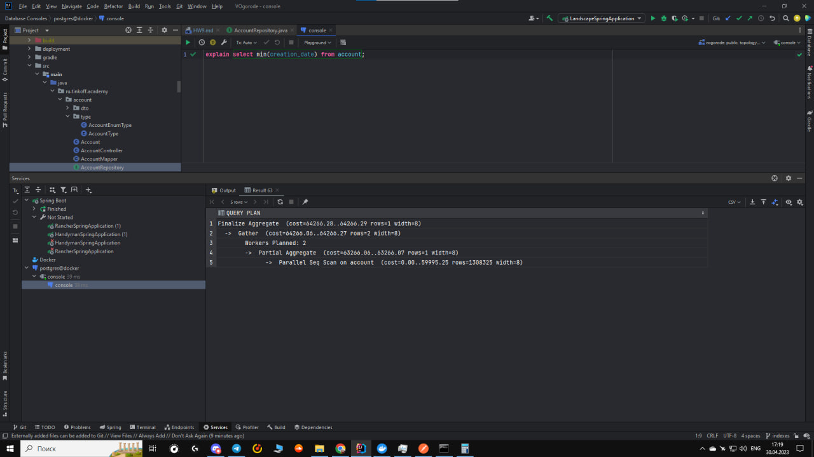
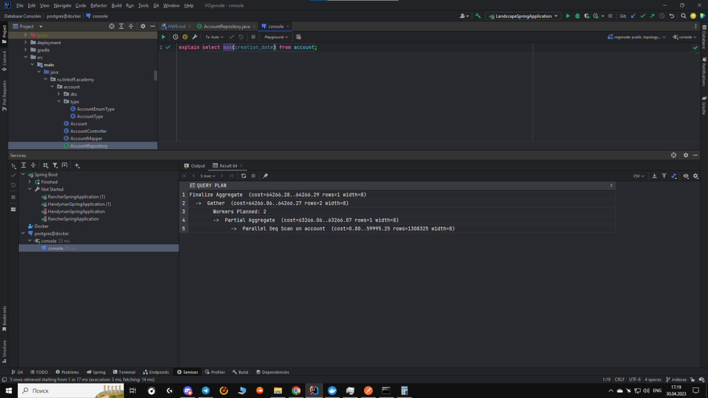

Особо большой разницу между запросами нет, тк в любом случае мы проходим по всем строкам из account и смотрим их дату создания.
Индексы в данной ситуации не нужны. Тк мы выбираем все строки, ни как не различая их.

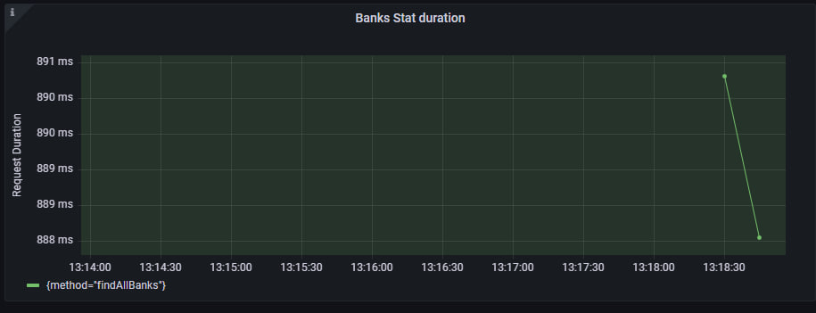
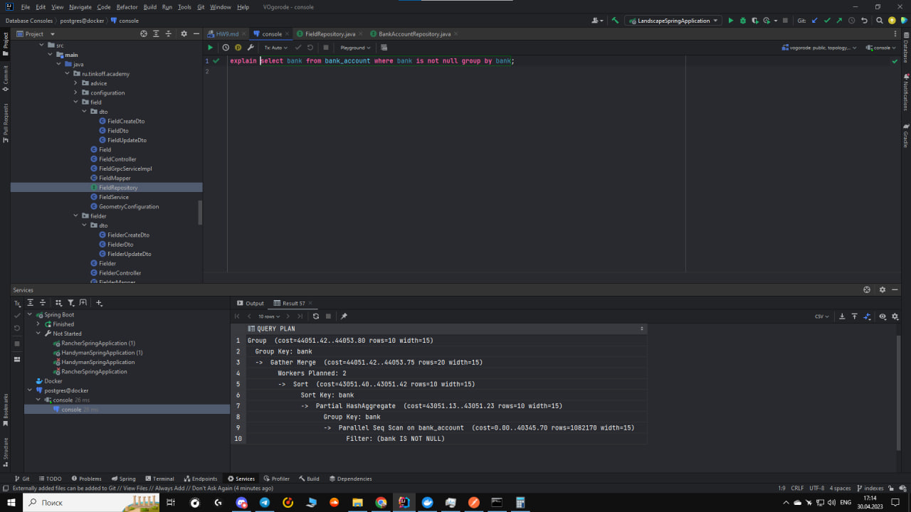

Индексы в этом случае также не нужны, даже если исключать null'ы, 
их кол-во будем минимально и поэтому мы не получим никакого прироста по скорости.

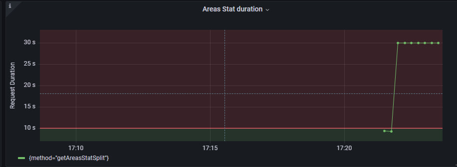
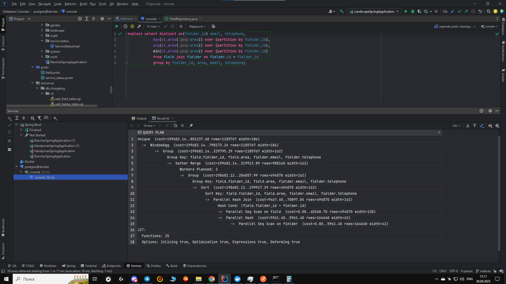
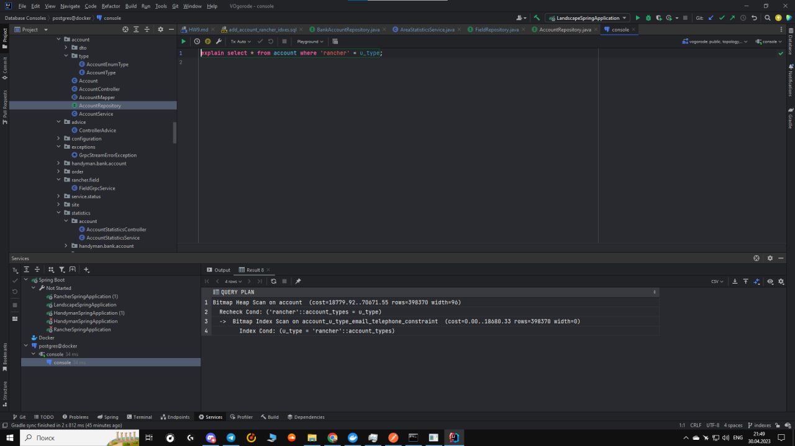
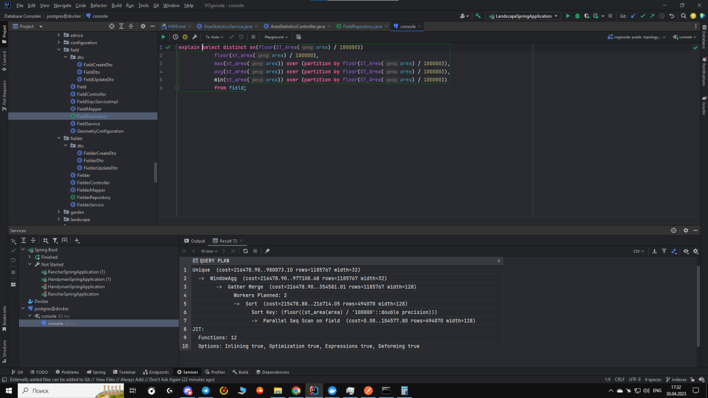

Изначально низкая длительность запроса обусловлена тем, что мы запрашивали разбивку по площади
тк при таком запросе нам надо только сходить в RancherService, получить его ответ и замапить в ответ
HandymanService. В то же время при запросе разбивки по логину нам необходимо по полученному ответу
найти логин пользователя по почте и телефону (для быстроты ответа это происходит в самом сервисе,
то есть мы сначала получаем все аккаунты, потом превращаем в мапу в которой ключ это почта и телефон,
а значение логин).

## Метрики статистики с индексами

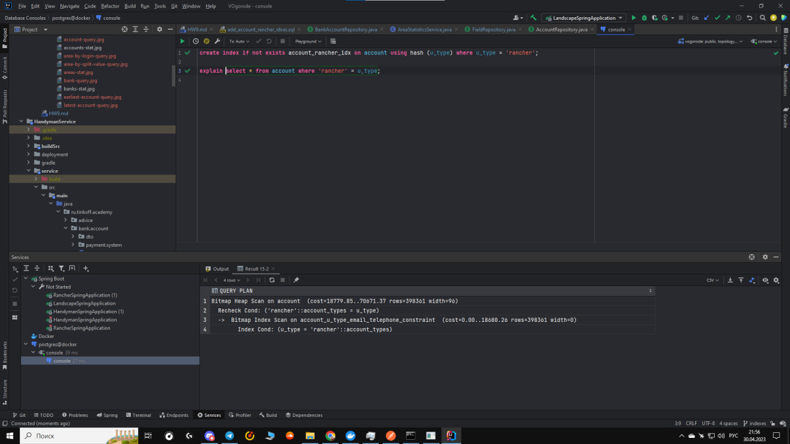

Добавление индекса на тип пользователя rancher ничего не меняет, тк планировщик считает что выгоднее использовать индекс,
созданный при добавлении ограничений на уникальность почты и телефона по типу.

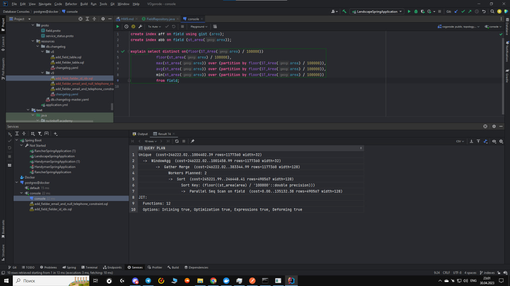
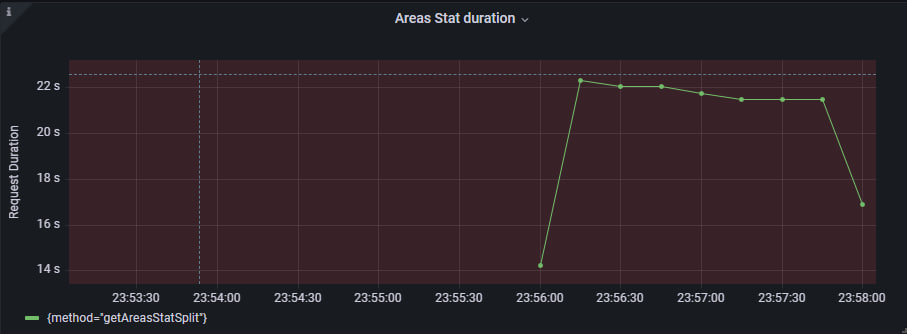

Добавление индексов на area также не дает никакого прироста. Так получается из-за того что мы не выбираем по какому-то
конкретной территории или ее площади. Разница в длительности скорее всего из-за того что были сгенерированы очень 
разные по площади территории (по тому же самому сплиту такая разница).

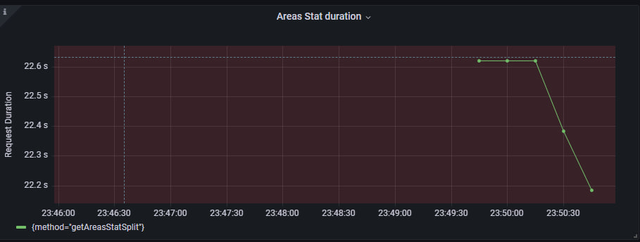
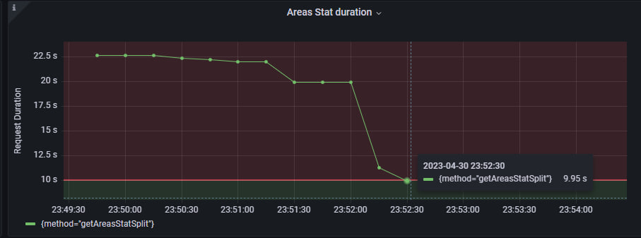

При добавлении индекса на fielder_id мы получаем приросты из-за уменьшения времени на join таблиц, группировки и сортировки по ключам.
